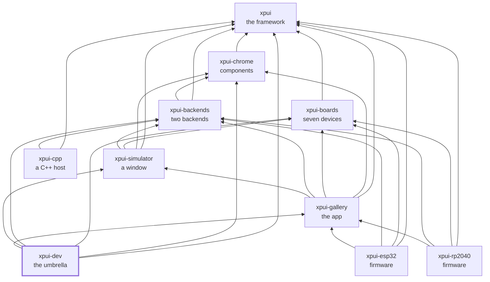

# `xpui-dev`

> ⚠️ **Under heavy development.** Not production-ready. The API can break
> without notice. Use at your own risk.

[](https://github.com/XPUI-Framework/xpui-dev/actions/workflows/ci.yml) [](LICENSE)

The umbrella. The nine libraries and applications, checked out side by side
and built as one — ten directories counting this one. A change in one
repository is a `cargo update` in the others, and nothing else says the
others still work; this does, while the change is still local, before any of
it is pushed. It also holds the checks no single repository can make: that
every copy of a shared file is still one file, that every organisation URL
resolves, and that the lock files agree about the crates whose types cross a
boundary.

## Using it

The ten cloned beside each other, exactly as
[`xpui`'s `docs/orientation.md`](https://github.com/XPUI-Framework/xpui-framework/blob/main/docs/orientation.md)
lays them out — the `[patch]` table in `Cargo.toml` points at `../xpui`,
`../xpui-chrome` and so on by relative path, so that layout is the whole
requirement, on any machine. Then, from here:

```bash
./build-and-test.sh cross    # what no single repository can see — what CI runs
```

Nothing depends on this repository and it publishes nothing. Of its two
workspace members, [`gate/`](gate/) has no code: it names eleven of the twelve
libraries the `[patch]` table covers, so resolving it resolves the stack
against the checkouts on disk. [`xtask/`](xtask/) is the other, and is the
gate.

## Requirements

- **The ten checked out side by side.** A patched sibling that is missing is
  a hard cargo error; `cross` names all the missing ones in one message
  first, including the three nothing patches.
- **SDL2**, because building the stack builds the simulator.
- **`git fetch --all` in every sibling first.** The URL check resolves
  `blob/main` links against each sibling's `origin/main`, so a stale remote
  is a stale check.

## Checking it

```bash
./build-and-test.sh cross    # the cross-repository half, seconds to minutes
./build-and-test.sh          # the above, plus every sibling's own gate — twenty minutes
```

The checks themselves are in [`xtask/`](xtask/) — this repository's own list,
in Rust. Its cross-repository stages are the ones no sibling has; `format`,
`lint` and `rustdoc` cover this repository's own two crates, as they do
everywhere. There is no `fix` mode: nothing here formats a sibling. What each check catches, and what `cross` leaves to
the siblings, is in
[docs/working-across-repositories.md](docs/working-across-repositories.md).

## Where next

| | |
|---|---|
| [docs/working-across-repositories.md](docs/working-across-repositories.md) | the `[patch]` trap, the lock file that does not travel, the shared files and sections, what each check catches, and what `cross` skips |
| [docs/contributing.md](docs/contributing.md) | how a change that crosses repositories is made, in what order it is pushed, and how a shared file is changed in all ten at once |

## Where it sits

Every arrow is a dependency in a `Cargo.toml`, and they all point inward
toward `xpui`, which depends on nothing at all. That is the rule the
organisation is arranged around: a backend can be written without the framework
knowing it exists, and a firmware reaches whatever it needs directly rather
than through whoever happens to sit above it.



## License

MIT — see [LICENSE](LICENSE). Copyright (c) 2026 Thiago Holanda.
