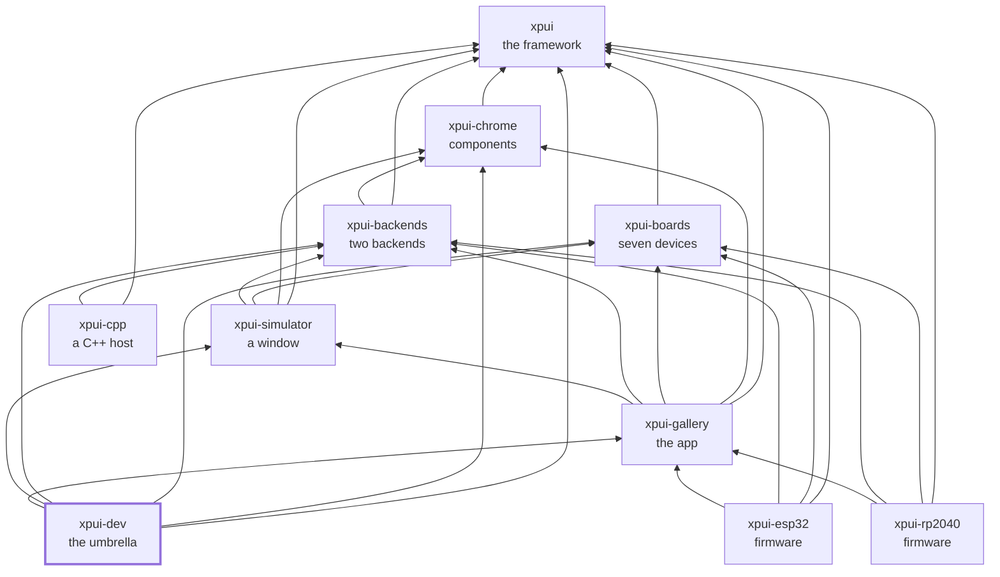

# `xpui-dev`

> ⚠️ **Under heavy development.** Not production-ready. The API can break
> without notice. Use at your own risk.

The umbrella. The nine libraries and applications, checked out side by side
and built as one — ten directories counting this one.

**It needs the ten checked out side by side, and nothing else.** The `[patch]`
table below points at siblings by relative path — `../xpui`, never an absolute
one — so the layout in [What it is for](#what-it-is-for) is the whole
requirement, on any machine.

The one thing that does not travel is `Cargo.lock`. It is resolved against
those patched paths, so it records what the stack looked like on the machine
that last ran the gate rather than what a fresh clone of the nine would
resolve to. Treat it as a local artifact; `locks_agree` reads the *siblings'*
lock files, not this one.

## What it is for

Before the split, `./build-and-test.sh` proved a change across the framework,
three backends, the boards and five examples at once, and CI ran it as one
step. A `Chrome` trait change was one commit.

Afterwards it is a change in one repository and a `cargo update` in five
others, and nothing says the five still work. This is what says so — while the
change is still local, before any of it is pushed.

```bash
git clone git@github.com:XPUI-Framework/xpui-framework.git xpui
git clone git@github.com:XPUI-Framework/xpui-chrome.git
git clone git@github.com:XPUI-Framework/xpui-boards.git
git clone git@github.com:XPUI-Framework/xpui-backends.git
git clone git@github.com:XPUI-Framework/xpui-simulator.git
git clone git@github.com:XPUI-Framework/xpui-gallery.git
git clone git@github.com:XPUI-Framework/xpui-rp2040.git
git clone git@github.com:XPUI-Framework/xpui-esp32.git
git clone git@github.com:XPUI-Framework/xpui-cpp.git
git clone git@github.com:XPUI-Framework/xpui-dev.git

cd xpui-dev && ./build-and-test.sh
```

The checks are in [`xtask/`](xtask/), in Rust. What is here is only what no
single repository can see; each of the nine has its own `xtask/` holding its
own list, and nothing is shared between them but ten modules holding the
parts that are the same job everywhere: reading a markdown fence, a manifest,
and a path.

The framework's directory is `xpui`, matching the crate; its repository is
called `xpui-framework`.

## What it checks

| | |
|---|---|
| every sibling is present | a missing one would otherwise resolve from GitHub, and a local change would go untested with the build green |
| every copy of a shared file is the same file | the licence, `clippy.toml` and the ten `xtask` modules below each repository's own check list are copied, not shared. A copy nobody compares is a fork with a delay on it. Each repository's `xtask/src/main.rs` is deliberately *not* compared: it is that repository's own list of checks |
| every copy of a shared section is the same section | the `## Where it sits` diagram in every README, apart from the `style` line that bolds the repository you are in, and the `[workspace.lints]` table in every workspace root |
| both FreeInk SDK pins agree | `xpui-backends` compiles the shim against the SDK's headers and `xpui-cpp` links it. A revision written down twice is one that will disagree with itself |
| every organisation URL resolves | `doc_paths` reads relative links and says so; nothing else anywhere reads a `github.com/XPUI-Framework/…` URL, and twenty-five of them were once 404s |
| every lock file agrees | `embedded-graphics`, `embedded-graphics-core`, `critical-section` and `u8g2-fonts` cross repository boundaries as *types*. `DrawTarget` from 0.8.1 is not `DrawTarget` from 0.8.2, and the error blames a trait rather than a version |
| the whole stack builds and tests | from local paths, so what is tested is what is on disk |
| every repository gates itself | the default run only. `./build-and-test.sh cross` skips this, and CI uses `cross` because each repository's own workflow has already done it |

Each repository still gates itself. This gates what no single one can see.

## The trap in `[patch]`

Cargo matches a patch to a dependency **by URL string**. A trailing `.git`,
`http` for `https`, or a different case, and the patch silently does not
apply — the build succeeds against the pushed revision, and the local change
is not tested at all. `Cargo.lock` is where to check: every `xpui*` crate
should have no `source` line.

## Where it sits

Every arrow is a dependency in a `Cargo.toml`, and they all point inward
toward `xpui`, which depends on nothing at all. That is the rule the
organisation is arranged around: a backend can be written without the framework
knowing it exists, and a firmware reaches whatever it needs directly rather
than through whoever happens to sit above it.



## License

MIT — see [LICENSE](LICENSE). Copyright (c) 2026 Thiago Holanda.
